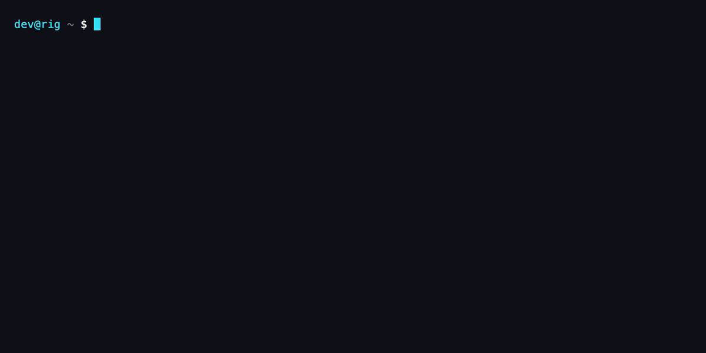
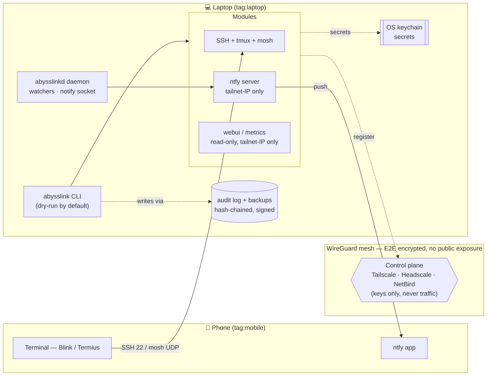

<div align="center">

# Abysslink

### Across the abyss. Linked.

**Vibe-code from your phone — securely.**
*Drive Claude Code, Cursor, Aider, Codex, or any AI coding agent on your laptop straight from your phone — over hardened SSH on a private mesh VPN, audited and reversible by default. Kick off an agent, get a push the second it needs you, tap back in, type the next instruction. (Also rock-solid as plain secure SSH to your own box.) One static Go binary, macOS + Linux.*

[](https://github.com/abysslink/abysslink/actions/workflows/test.yml)
[](https://github.com/abysslink/abysslink/actions/workflows/security.yml)
[](https://github.com/abysslink/abysslink/actions/workflows/repro-check.yml)
[](https://securityscorecards.dev/viewer/?uri=github.com/abysslink/abysslink)
[](go.mod)
[](LICENSE)
[](#supported-platforms)
[](CONTRIBUTING.md)

</div>

<p align="center"></p>

<!-- GIF is generated from demo/abysslink.tape via `vhs demo/abysslink.tape` (see demo/README.md). -->

---

Abysslink converges your laptop into a remote-access rig you can safely drive from a phone: a [WireGuard](https://www.wireguard.com/) mesh VPN, hardened SSH, persistent `tmux`, roaming `mosh`, self-hosted push notifications, and an optional read-only web dashboard — **all locked down by default, every mutation backed up and written to a tamper-evident audit log.** No public internet exposure, no third-party broker, no telemetry, no SaaS.

**Built for vibe coders first.** Start an AI agent on a real machine, then step away from the desk — Abysslink keeps you in the loop from your phone: a push the second the agent stops or needs input, a tap back into the *live* `tmux` session, type the next instruction, repeat. No copy-pasting terminal output into a chat bot; you're in the actual shell. And because it's hardened SSH underneath, it doubles as a rock-solid secure remote shell to your own box — without exposing it to the public internet or handing your keystrokes to a third party.

One static Go binary. macOS + Linux. Apache-2.0.

> [!NOTE]
> **Agent-agnostic by design.** "Vibe-code Claude from your phone" is the headline demo, but Claude Code is just **one opt-in consumer** of a generic `notify`/`watch` core. Swap in Cursor, Aider, Codex, a `make deploy`, a long test run — or nothing at all, and use Abysslink as plain hardened SSH. There is zero agent-specific logic in the networking, SSH, or notification layers.

---

## Table of contents

- [Why this exists](#why-this-exists)
- [Features](#features)
  - [Networking & access](#networking--access)
  - [Session resilience](#session-resilience)
  - [Notifications & observability](#notifications--observability)
  - [Safety & auditability](#safety--auditability)
  - [Security hardening](#security-hardening)
- [Design philosophy](#design-philosophy)
- [Installation](#installation)
- [Quick start](#quick-start)
- [Usage](#usage)
- [Configuration](#configuration)
- [Security](#security)
  - [Defense in depth](#defense-in-depth)
  - [What Abysslink refuses to do](#what-abysslink-refuses-to-do)
  - [Threats &amp; mitigations](#threats--mitigations)
- [Architecture](#architecture)
- [Supported platforms](#supported-platforms)
- [Documentation](#documentation)
- [Contributing](#contributing)
- [Roadmap](#roadmap)
- [License](#license)
- [Acknowledgments](#acknowledgments)

---

## Why this exists

Most "control my laptop from my phone" setups fail in one of three ways. Abysslink rejects all three.

<table>
<tr><th>Approach</th><th>Failure mode</th><th>Abysslink instead</th></tr>
<tr>
<td><b>Telegram / chat bots</b></td>
<td>A third party sees every command and every pasted output — API keys, DB dumps, key fingerprints — indexed and tied to your phone number. No real shell, no job control, no persistence.</td>
<td>WireGuard end-to-end encryption. No broker sees your traffic. A <i>real</i> terminal.</td>
</tr>
<tr>
<td><b>ngrok / Cloudflare Tunnel / reverse SSH</b></td>
<td>Punches a hole from your laptop to the public internet. A misconfig is a wide-open shell to a stranger; the tunnel vendor sits in the middle.</td>
<td>No public exposure. Funnel is rejected at the config-schema level — you <i>cannot</i> accidentally enable it.</td>
</tr>
<tr>
<td><b>VNC / RDP / TeamViewer</b></td>
<td>Ships raw pixels — expensive and unusable on a degraded cell link — and still relies on a third party to broker the session.</td>
<td>Text terminal over UDP. Survives wifi↔cell roaming. No broker.</td>
</tr>
</table>

The mesh-VPN model means **your phone and laptop talk directly to each other.** The coordination server (Tailscale, or a self-hosted Headscale / NetBird control plane) exchanges public keys only — it never sees your traffic, commands, or output. If it went offline, your devices keep talking.

---

## Features

### Networking & access

- **Mesh VPN, no public exposure** — runs over WireGuard via [Tailscale](https://tailscale.com) by default, with **self-hosted [Headscale](https://github.com/juanfont/headscale) and [NetBird](https://netbird.io) control planes** as first-class alternatives (`abysslink server …`). Your traffic is end-to-end encrypted and never traverses a vendor relay.
- **Tagged, least-privilege ACLs** — Abysslink writes a minimal policy: `tag:mobile → tag:laptop` over SSH + the mosh UDP range only. The phone can reach the laptop; the laptop cannot reach back; nothing else in the tailnet can reach either. ACLs round-trip as HuJSON (`abysslink acl diff/push`) so comments survive.
- **Tailnet Lock by default** — every device that joins must be cryptographically signed by a trusted key. An attacker who compromises your VPN account *still* cannot silently add a rogue node. Disablement secrets are printed **once** to stdout and never written to disk.
- **Hardened SSH** — Tailscale SSH with a 12-hour re-check period (`checkPeriod`) that can be lowered but never silently raised. OpenSSH fallback for the self-hosted backends.

### Session resilience

- **mosh + tmux** — `mosh` (UDP roaming transport) keeps the session alive as your phone hops wifi↔cell, sleeps, or loses signal; `tmux` + `tmux-resurrect` persist the session across disconnects and reboots. Reconnect hours later, exactly where you left off.
- **Fleet-aware** — enroll multiple laptops as named *rigs* (`abysslink enroll rig`) and fan commands out with `--rig <name>` / `--all-rigs`. Wake a sleeping rig over the LAN with `abysslink wol <rig>`.

### Notifications & observability

- **Self-hosted push** — a built-in [ntfy](https://ntfy.sh) server bound **exclusively to the tailnet IP** (never `0.0.0.0`). Notifications go phone → your laptop → phone; no Pushover, no Telegram, no third party ever sees the content. The admin password lives in the OS keychain.
- **Session-aware wakes** — every notification names the exact rig, agent, and pane that needs you (`rig-1 · claude · %3 needs input`), so a tap drops you straight back into *that* live `tmux` session — not a guess. Built on a typed notification schema and a live `tmux -CC` session registry.
- **Opaque push, content over the tailnet** — the push payload carries **only routing metadata — no body, no secrets, no code.** Your phone fetches the real notification text from the daemon over the tailnet (token-keyed, single-use, TTL'd, and fail-closed on any non-tailnet bind). APNs / FCM / ntfy.sh see a device token and a generic title, never content; each fetch lands a hash-only delivery receipt, and a safe fallback title still renders with zero network access.
- **Watchers** — `abysslink watch` fires a push when a tmux pane goes idle (a prompt is waiting), a log file matches a regex, or an HTTP endpoint changes status. Run by the `abysslinkd` daemon.
- **AI-agent integration (opt-in)** — `abysslink enable claudecode --apply` (then `abysslink up --apply`) wires Claude Code's Stop/Notification hooks into the generic `notify` module so your phone buzzes the moment the agent needs you; `abysslink claudecode disable` unwires them. Any other agent, build, or long-running job plugs into the same `notify`/`watch` core. *This is the only agent-aware code in the tree.*
- **Metrics & digests (opt-in)** — Prometheus metrics on a tailnet-only listener, plus a scheduled daily ntfy security-posture digest.

### Safety & auditability

- **Dry-run is the default** — every system-mutating command prints its plan and changes nothing until you add `--apply`. `--explain` annotates each planned action with its rationale.
- **Backup + tamper-evident audit log on every mutation** — Abysslink never touches a file without first backing it up and appending a hash-chained, optionally-signed audit entry (`internal/audit`). Verify the chain with `abysslink audit verify`; undo anything with `abysslink backup restore <path>`.
- **Reversible by design** — `abysslink repair` auto-fixes doctor findings; `abysslink uninstall` reverses every change Abysslink ever made, restoring files from backups.

### Security hardening

- **Fail-closed disk encryption** — `abysslink doctor` exits `2` (fatal) if FileVault (macOS) / LUKS (Linux) is off. Encryption is not optional.
- **No secrets on argv, ever** — API keys and passwords are read from stdin or the OS keychain (macOS `security`, Linux `secret-tool` / `pass`), never passed as flags. The audit log records titles and diff hashes — **never body content** that could contain a token.
- **Signed, reproducible releases** — builds are reproducible (`SOURCE_DATE_EPOCH` from git, `-trimpath`), and `abysslink upgrade` / `abysslink verify` refuse to install a binary without a valid [cosign](https://github.com/sigstore/cosign) signature and SLSA provenance. Upgrade refuses to run as root.
- **Sandboxed where the OS allows it** — Linux Landlock confines filesystem access for sensitive operations.
- **Per-device, revocable credentials** — `abysslink enroll phone` mints a per-device push token, a bearer credential, and a short-lived **SSH certificate** from an in-process CA (keys in the OS keychain). `abysslink panic` and `abysslink device revoke` revoke them atomically — the daemon stops honouring the bearer immediately and `sshd` rejects the revoked certificate (via an auto-installed CA-trust + revocation list). Device `last_seen` is tracked and stale devices are flagged.
- **Emergency kill switch** — `abysslink panic` tears down the VPN session, revokes the phone's auth key, and destroys the local API key in seconds, with **no confirmation prompt**.

---

## Design philosophy

- **Paranoid by default, not configurable into insecurity.** Dangerous options are rejected at the schema level (Funnel), fail closed (unencrypted disk), or require an explicit acknowledgement flag (raising `checkPeriod`). You cannot foot-gun yourself by editing YAML.
- **Every mutation is observable and reversible.** No silent writes. The audit log + backup pair is non-negotiable and routed through a single `internal/audit` chokepoint — nothing else in the codebase calls `os.WriteFile`.
- **Generic core, opt-in consumers.** Networking, SSH, notifications, and watchers know nothing about any specific AI agent — or about each other's concerns. Claude Code, code-server, and ttyd are pluggable modules, not dependencies.
- **One static binary, no runtime.** Go 1.26, no interpreter, no daemon you didn't ask for. The optional web UI is gated behind a build tag so the base binary links zero web/TLS surface.
- **No telemetry. Period.** The binary makes no outbound calls except to your VPN's local API and your own ntfy server.

---

## Installation

> **Prerequisites:** macOS 13+ or a supported Linux distro · disk encryption enabled (FileVault / LUKS) · the VPN backend client for your chosen backend. Building from source requires **Go 1.26+**.

### Install script (recommended)

Installs `abysslink` and the `abysslinkd` daemon to `/usr/local/bin` (root) or `~/.local/bin` (non-root). Always verifies the SHA-256 checksum manifest; additionally verifies the cosign signature bundle when `cosign` is on your `PATH`.

```bash
curl -fsSL https://raw.githubusercontent.com/abysslink/abysslink/main/scripts/install.sh | sh
```

To **require** a cosign signature and fail closed when `cosign` is missing:

```bash
curl -fsSL https://raw.githubusercontent.com/abysslink/abysslink/main/scripts/install.sh | ABYSSLINK_REQUIRE_COSIGN=1 sh
```

### Nix

```bash
nix build github:abysslink/abysslink#abysslink
```

```nix
# flake.nix
inputs.abysslink.url = "github:abysslink/abysslink";
```

### Prebuilt binaries

Download a release tarball (`abysslink_<version>_<os>_<arch>.tar.gz`, containing both `abysslink` and `abysslinkd`) from [Releases](https://github.com/abysslink/abysslink/releases) and verify before use. Each release ships one signed checksum manifest — verify the cosign signature on the manifest, then your tarball's SHA-256 against it:

```bash
VERSION=v3.0.0   # the release you downloaded

# Download the checksum manifest and its cosign v3 bundle
curl -fsSL "https://github.com/abysslink/abysslink/releases/download/${VERSION}/abysslink_${VERSION#v}_checksums.txt"        -o checksums.txt
curl -fsSL "https://github.com/abysslink/abysslink/releases/download/${VERSION}/abysslink_${VERSION#v}_checksums.txt.bundle" -o checksums.txt.bundle

# Verify the cosign signature (offline — the bundle embeds the cert chain + Rekor proof)
cosign verify-blob \
  --bundle checksums.txt.bundle \
  --offline \
  --certificate-identity-regexp '^https://github\.com/abysslink/abysslink/\.github/workflows/release\.yml@refs/tags/.*$' \
  --certificate-oidc-issuer https://token.actions.githubusercontent.com \
  checksums.txt

# Verify your tarball's SHA-256 against the signed manifest
grep "abysslink_${VERSION#v}_linux_amd64.tar.gz" checksums.txt | sha256sum --check
```

### From source

```bash
git clone https://github.com/abysslink/abysslink
cd abysslink
make build        # produces ./abysslink and ./abysslinkd (reproducible)
make install      # installs both to GOBIN
```

> **Uninstalling:** remove the binaries with `rm ~/.local/bin/abysslink ~/.local/bin/abysslinkd` (or the `/usr/local/bin` equivalents). `abysslink uninstall` reverses every *system* change Abysslink made but does not delete the binaries themselves.

### The `abysslinkd` daemon (optional, opt-in to run)

Every install ships **two** binaries: the `abysslink` CLI and the `abysslinkd` background daemon. The CLI alone handles all one-shot work — `up`, `doctor`, `enroll`, `acl`, `panic`, hardening. The daemon adds the *continuous, real-time* features:

- **Watchers** — push to your phone when a tmux pane goes idle (a prompt is waiting), a log matches a regex, or an HTTP endpoint changes.
- **Tailnet content store** — opaque notification bodies and the one-scan **credential pull** for `enroll phone`.
- **Ack receipts** — true phone-side delivery confirmation.
- `abysslink notify` and the Claude Code hooks deliver through it (falling back to a direct push when it's down).

Installing the binary costs nothing until you opt in to *running* it as a login service:

```bash
abysslink daemon enable --apply   # launchd (macOS) / systemd --user (Linux); starts on boot
abysslink daemon status           # service: running · socket: reachable
```

Without a running daemon, watchers don't fire and `enroll phone` shows credentials inline instead of the one-scan pull QR. See [the daemon section in the quickstart](docs/quickstart.md#1b-the-abysslinkd-daemon) for details.

---

## Quick start

Under ten minutes from first command to a working `mosh rig -- tmux new -A -s main` on your phone.

```bash
# 1. Interactive setup wizard — writes ~/.config/abysslink/abysslink.yaml
abysslink init

# 2. Preview every change (dry-run is the default — nothing is mutated)
abysslink up

# 3. Apply when the plan looks right
abysslink up --apply

# 4. Pair your phone — mints a tagged auth key and shows an ANSI QR code
#    (dry-run by default too: --apply does the actual pairing)
abysslink enroll phone --apply

# 5. Deep health check — exits 0 (ok) / 1 (warn) / 2 (fatal)
abysslink doctor
```

Then, from your phone (via Blink, Termius, or Termux):

```bash
mosh rig -- tmux new -A -s main
```

---

## Usage

The most common commands, inline. The full surface — every subcommand and flag — lives in **[docs/cli-reference.md](docs/cli-reference.md)**.

> **Global flags** (on every command): `--config <path>` · `--dry-run` (default) / `--apply` · `--yes` (skip prompts) · `--json` · `-v/--verbose` · `--explain` · `--rig <name>` / `--all-rigs` / `--strict` (fleet targeting).

### Set up and converge

```bash
abysslink init                    # interactive TUI bootstrap → abysslink.yaml
abysslink up                      # show the plan (dry-run)
abysslink up --apply              # converge the system to match config
abysslink status                  # one-screen health summary (--json for machines)
abysslink doctor                  # deep checks; fail-closed on the dangerous ones
abysslink repair                  # auto-fix what doctor flagged
```

### Drive terminals & notifications

```bash
abysslink enroll phone --apply            # pair a phone (QR + poll for join)
abysslink notify "deploy done" "v1.2.3"   # one-off push
abysslink notify -- npm run build         # push when the wrapped command exits
abysslink watch add --pane 0 --apply      # buzz when a tmux pane goes idle at a prompt
abysslink enable claudecode --apply       # opt in: AI-agent hooks → notify (wired on next `up --apply`)
```

### Audit, back up, recover

```bash
abysslink logs                            # tail the audit log (filter by age/module)
abysslink audit verify                    # verify the tamper-evident chain
abysslink backup ls                       # list every file Abysslink changed
abysslink backup restore /etc/ssh/sshd_config --apply   # undo a change to a file
```

### Manage the network

```bash
abysslink acl diff                        # preview ACL changes (HuJSON)
abysslink acl push --apply                # converge the tailnet policy
abysslink lock status                     # Tailnet Lock state
abysslink rotate ntfy-creds --apply       # rotate the ntfy admin password + keychain
```

### Self-hosted control plane (advanced)

```bash
abysslink server headscale init --apply   # provision a Headscale control server
abysslink server netbird init --apply     # provision a NetBird control server
```

### Emergency

```bash
abysslink panic                           # immediate: disconnect, revoke phone, destroy API key
abysslink threat-model                    # print the threat model with live ✓/✗ defense status
```

<details>
<summary><b>Optional modules</b> — enable per workload</summary>

```bash
abysslink enable claudecode --apply       # AI-agent hooks → notify
abysslink enable code-server --apply      # VS Code in the browser, tailnet-IP only
abysslink enable ttyd --apply             # browser terminal, tailnet-IP only
```

Known modules: `ssh`, `tmux`, `mosh`, `ntfy`, `notify`, `watch`, `claudecode`, `code-server`, `ttyd`, `eternal-terminal`, `syncthing`, `upsnap`, `atuin`, `sandbox`, `asciinema`. The read-only web dashboard is its own stanza — set `webui.enabled: true` then `abysslink up --apply`. See [docs/modules/](docs/modules/).

</details>

---

## Configuration

Abysslink reads `~/.config/abysslink/abysslink.yaml` (override with `--config`, or set `XDG_CONFIG_HOME`). The `init` wizard writes it interactively; strict-mode YAML rejects unknown keys. Annotated reference: [abysslink.yaml.example](abysslink.yaml.example) and [docs/configuration.md](docs/configuration.md).

### Top-level options

| Option | Type | Default | Description |
|---|---|---|---|
| `version` | int | `1` | Config schema version (only `1` is accepted). |
| `backend.type` | string | `tailscale` | VPN control plane: `tailscale`, `headscale`, or `netbird`. |
| `tailnet.ssh` | bool | `true` | Enable VPN-native SSH. |
| `tailnet.lock.enabled` | bool | `true` | Require cryptographic device authorization (Tailnet Lock). |
| `tailnet.lock.disablement_secrets` | int | `2` | Number of disablement secrets to generate (printed once). |
| `mobile.tag` | string | `mobile` | ACL tag granted to the phone. |
| `mobile.ports` | list | `[tcp/22, udp/60000-61000]` | Ports the phone may reach on the rig. |
| `mobile.ssh_check_period` | duration | `12h` | SSH re-check window; lowerable, never silently raised. |
| `modules.ntfy.enabled` | bool | `true` | Self-hosted push server (tailnet-IP bind only). |
| `modules.ntfy.port` | int | `2586` | ntfy listen port. |
| `modules.notify.default_topic` | string | `rig` | Default ntfy topic for notifications. |
| `modules.watch.panes` | list | `[main]` | tmux panes watched for idle prompts. |
| `claudecode.enabled` | bool | `false` | Opt-in Claude Code hook integration. |
| `claudecode.api_key_source` | string | `keychain` | Where the Anthropic key is read from (`keychain`/`env`). |
| `hardening.filevault` / `hardening.luks` | string | `required` | Disk-encryption enforcement (`required` → doctor fails closed). |
| `hardening.firewall_stealth` | bool | `true` | macOS stealth-mode firewall. |
| `hardening.ufw_default_deny` | bool | `true` | Linux UFW default-deny posture. |
| `webui.enabled` | bool | `false` | Read-only web dashboard (build-tag + opt-in gated). |
| `webui.read_only` | bool | `true` | **Enforced `true`** — `false` is rejected at validation. |
| `webui.port` | int | `8443` | Web UI TLS listen port (tailnet-IP bind only). |
| `observability.metrics.enabled` | bool | `false` | Prometheus metrics on a tailnet-only listener. |
| `observability.digest.enabled` | bool | `false` | Scheduled daily ntfy security-posture digest. |

Full schema, every module stanza, and the self-hosted backend (`server.headscale` / `server.netbird`) options: **[docs/configuration.md](docs/configuration.md)**.

---

## Security

> Security is not a feature of Abysslink — it is the reason it exists. The convenience (drive your rig from your phone) is the easy part; doing it *without opening a hole an attacker can walk through* is the hard part everyone else skips.

The moment you can reach your terminal from your phone, you have created a new attack surface: a path from a small, easily-lost device — on hostile coffee-shop wifi — straight into a machine holding your source, your SSH keys, and your cloud credentials. The naive solutions (a chat bot, a public tunnel, a remote-desktop relay) all "work" by handing that path to a third party or exposing it to the internet. Abysslink's entire design is the refusal to do that.

**Scope.** Abysslink defends the path from a phone to a development rig over a hostile network, assuming the phone may be lost or stolen. It does **not** replace endpoint security on an already-compromised laptop, and it does not audit the upstream tools (Tailscale, mosh, ntfy) — it *configures them safely*, closing the footguns their flexible defaults leave open.

### Defense in depth

No single control is trusted to hold. Each layer assumes the others may fail.

| Layer | Control | Why it matters — what breaks without it |
|---|---|---|
| **Network** | WireGuard mesh; **no public exposure**; Funnel rejected at the schema | A public tunnel is a brute-forceable shell to a stranger. Direct, encrypted peer-to-peer means there is no URL to find and no relay to subpoena. |
| **Identity** | Tailnet Lock + tagged, least-privilege ACLs (`tag:mobile → tag:laptop` only) | Without Lock, anyone who phishes your VPN account silently adds a rogue node. Without tight ACLs, one compromised device can pivot across the whole tailnet. |
| **Transport** | Hardened SSH, 12h `checkPeriod` floor, OpenSSH fallback | A long-lived session on a stolen phone is a standing key to your machine. The re-check window bounds how long a lost device stays useful. |
| **Secrets** | OS keychain; **never on argv, never in logs** | Secrets on the command line leak via `ps`, shell history, and CI logs. Abysslink reads them from stdin/keychain and stores only diff *hashes* in the audit log. |
| **Integrity** | Hash-chained, signable audit log; reproducible builds; cosign + SLSA on install/upgrade | If you can't prove what changed, you can't trust the system after an incident. If you can't verify the binary, a poisoned update owns you. |
| **Recovery** | Backup on every mutation; `backup restore`; `panic`; `uninstall` | A security tool you can't fully reverse is its own liability. Every change is undoable; the kill switch is one word. |
| **Enforcement** | `doctor` fails *closed* (exit `2`) on unencrypted disk; refuses to run `upgrade` as root | Defaults that *warn* get ignored. Defaults that *refuse to proceed* actually protect people. |

### What Abysslink refuses to do

Security defaults that only *warn* get clicked through. These are enforced in code — you cannot configure your way past them:

- ❌ **Bind a service to `0.0.0.0`** — listeners resolve to the tailnet IP, full stop.
- ❌ **Enable Tailscale Funnel** — rejected at the YAML schema; there is no flag to turn it on.
- ❌ **Put a secret on `argv`** — keys/passwords come from stdin or the keychain.
- ❌ **Write a secret to the audit log** — entries carry titles and diff hashes only.
- ❌ **Store Tailnet Lock disablement secrets on disk** — printed once to stdout, then gone.
- ❌ **Mutate the system without a plan** — dry-run is the default; `--apply` is deliberate.
- ❌ **Run on an unencrypted disk** — `doctor` exits fatal until FileVault/LUKS is on.
- ❌ **Install an unverified binary** — `upgrade` checks the cosign signature first, and refuses root.
- ❌ **Phone home** — zero telemetry; the only outbound calls are your VPN's local API and your own ntfy server.

### Threats &amp; mitigations

Run `abysslink threat-model` to print this table with the live ✓/✗ status of each defense **on your machine**.

| Threat | Mitigation |
|---|---|
| Stolen phone | Per-device revocable credentials (push token + bearer + SSH cert from an in-process CA) on top of Tailnet Lock; `abysslink panic` / `device revoke` revoke immediately — the daemon drops the bearer and `sshd` rejects the revoked cert. |
| Stolen laptop | Disk encryption enforced (doctor fails closed); ntfy/webui/metrics bind tailnet-only. |
| Compromised VPN account | Tailnet Lock — a rogue node can't join without your signing key. |
| Secrets leaked via logs | Audit log stores diff hashes only; no secrets on argv; doctor scans for leaks. |
| Accidental public exposure | Funnel rejected at the schema level; listeners never bind `0.0.0.0`. |
| Supply-chain tampering | Reproducible builds; cosign signature + SLSA provenance verified on install/upgrade. |
| Injection via notification | ntfy is receive-only on the phone — no command-execution path back to the rig. |
| Unencrypted disk | `abysslink doctor` exits `2` (fatal). |

### Supported versions

| Version | Supported |
|---|---|
| `v1.x` | ✅ |
| `< v1.0` | ❌ |

Report vulnerabilities **privately** per **[SECURITY.md](SECURITY.md)** — do not open a public issue. 90-day coordinated disclosure; CVE coordination available. Full threat model and hardening guide: **[docs/security.md](docs/security.md)**.

---

## Architecture



**Layout** (`internal/` is private; `cmd/` holds the entry points):

| Package | Responsibility |
|---|---|
| `internal/cli` | Cobra command surface; the **only** package that writes to stdout/stderr (via `Printer`). |
| `internal/backend` | Pluggable VPN backends — `tailscale`, `headscale`, `netbird`. |
| `internal/audit` | The single mutation chokepoint: backup + hash-chained, signable audit log. |
| `internal/shell` | The single external-command chokepoint (`Runner`) — no `os/exec` elsewhere, no `sh -c`. |
| `internal/secrets` | OS keychain abstraction (`security` / `secret-tool`). |
| `internal/config` | Strict YAML schema, defaults, validation (Funnel/`0.0.0.0`/read-only enforcement). |
| `internal/tui` · `internal/qr` | Bubbletea wizard, ANSI QR enrollment. |
| `internal/metrics` · `internal/modules/webui` | Opt-in observability and read-only dashboard (build-tag isolated). |

---

## Supported platforms

| Platform | Tier |
|---|---|
| macOS 13 / 14 / 15 | 1 |
| Ubuntu 22.04 / 24.04, Debian 12, Fedora 40 | 1 |
| RHEL / CentOS 9, Arch, NixOS (flake) | 2 |

---

## Documentation

| Doc | Read it for |
|---|---|
| [docs/index.md](docs/index.md) | Overview and orientation. |
| [docs/quickstart.md](docs/quickstart.md) | Install + first-run walkthrough. |
| [docs/cli-reference.md](docs/cli-reference.md) | Every command and global flag. |
| [docs/configuration.md](docs/configuration.md) | Full `abysslink.yaml` schema and defaults. |
| [docs/security.md](docs/security.md) | Threat model, defense-in-depth, hardening. |
| [docs/modules/](docs/modules/) | Per-module docs (tailscale, ssh, tmux, mosh, ntfy, watch, claudecode). |
| [docs/operations/faq.md](docs/operations/faq.md) | Frequently asked questions. |
| [docs/operations/troubleshooting.md](docs/operations/troubleshooting.md) | When something won't converge. |
| [docs/headscale-ha.md](docs/headscale-ha.md) · [docs/netbird-scim.md](docs/netbird-scim.md) | Self-hosted control-plane operations. |

---

## Contributing

Contributions welcome under DCO sign-off (`git commit -s`) — **not** a CLA. Read **[CONTRIBUTING.md](CONTRIBUTING.md)**.

```bash
git clone https://github.com/abysslink/abysslink
cd abysslink
make lint test          # golangci-lint + gosec + semgrep, then race-enabled tests
make conformance        # behavioural conformance suite against a built binary
```

- Conventional commits (`feat:`, `fix:`, `docs:`, …), one PR per logical unit.
- All mutations go through `internal/audit`; all external commands through `internal/shell.Runner`; no `fmt.Println` in library code; license header on every Go file. (These are enforced by `make lint` and CI — see [CONTRIBUTING.md](CONTRIBUTING.md).)

---

## Roadmap

- [x] Tailscale backend + hardened SSH / mosh / tmux core
- [x] Self-hosted Headscale & NetBird control planes
- [x] Tamper-evident, signed audit log + reversible mutations
- [x] Fleet / multi-rig fan-out + Wake-on-LAN
- [x] Read-only web dashboard + Prometheus metrics (opt-in)
- [ ] Hosted documentation site
- [ ] Additional notification backends beyond ntfy
- [ ] Windows (WSL) tier-2 support

---

## License

[Apache-2.0](LICENSE). © Abysslink Contributors.

---

## Acknowledgments

Stands on the shoulders of [Tailscale](https://tailscale.com), [Headscale](https://github.com/juanfont/headscale), [NetBird](https://netbird.io), [WireGuard](https://www.wireguard.com/), [ntfy](https://ntfy.sh), [mosh](https://mosh.org/), [tmux](https://github.com/tmux/tmux), [Cobra](https://github.com/spf13/cobra), [Charm](https://charm.sh) (Bubbletea/Lipgloss/Huh), and [Sigstore](https://www.sigstore.dev/).
