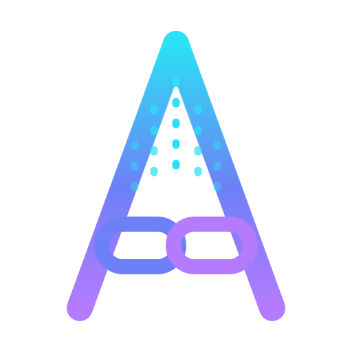

<div align="center">

<picture>
  <source media="(prefers-color-scheme: dark)" srcset="assets/brand/abysslink-mark-dark.svg">
  <source media="(prefers-color-scheme: light)" srcset="assets/brand/abysslink-mark-light.svg">
  
</picture>

# Abysslink

### Across the abyss. Linked.

**Vibe-code Claude from your phone — securely.**

*A Go CLI and optional daemon that turn your laptop into a hardened, phone-controlled dev rig: private mesh networking, SSH, tmux/mosh, self-hosted push, and an auditable undo path.*

[](https://github.com/abysslink/abysslink/actions/workflows/test.yml)
[](https://github.com/abysslink/abysslink/actions/workflows/security.yml)
[](https://github.com/abysslink/abysslink/actions/workflows/repro-check.yml)
[](https://github.com/abysslink/abysslink/releases/latest)
[](go.mod)
[](LICENSE)
[](#installation)

**New to Abysslink? Start with the plain-English intro → [abysslink.github.io/abysslink](https://abysslink.github.io/abysslink/)**

</div>

<p align="center"></p>

<p align="center"><sub>In this reproducible terminal demo, <code>abysslink up</code> previews a six-change plan, <code>quorum eval</code> rejects <code>tailscale funnel</code> without running it, and <code>threat-model</code> checks the current security posture. Source: <a href="demo/abysslink.tape">demo/abysslink.tape</a>.</sub></p>

## Why Abysslink

Long AI coding jobs make a short break feel risky: the agent might need you, or it might keep going when it should stop. Abysslink is like a baby monitor with a leash for your dev machine: your phone tells you when attention is needed, and you can reach the real terminal or stop the run. Your laptop stays yours, on a private network between your own devices. You get to leave the desk without giving up control.

## Trust, up front

- **No telemetry.** A CI conformance check rejects telemetry imports; remote calls happen only when you invoke a feature that needs its named provider.
- **Your notification body stays on your network.** The self-hosted push path sends routing metadata for the wake; the daemon serves the body over the tailnet. See [who sees what](docs/who-sees-what.md).
- **Every managed file change is recoverable.** Abysslink backs it up first and records an entry in a hash-chained audit log; `abysslink uninstall` previews and reverses its changes.
- **Early, but released.** `v4.1.0` is the current stable release line. The public repository has no stars yet, so field reports and corrections genuinely shape the project.

## Quick start

You need macOS 13+ or a supported Linux distribution, FileVault or LUKS, and a Tailscale account (or a supported Headscale/NetBird setup). Enable MagicDNS and HTTPS certificates if you want the daemon-backed notification content fetch and one-scan phone enrolment.

This is the shortest verified setup path. `init` is interactive; complete its prompts before the next line runs.

```sh
curl -fsSL https://raw.githubusercontent.com/abysslink/abysslink/main/install.sh | sh
abysslink init
abysslink up
abysslink up --apply
abysslink daemon enable --apply
abysslink doctor
abysslink enroll phone --apply
```

`up` always previews first. The final enrolment flow gives you the phone-side connection details and QR codes. For prerequisites, the connection command, and troubleshooting, use the [full quickstart](docs/quickstart.md).

## Installation

The release installer, Homebrew cask, and release archives install both `abysslink` and the optional `abysslinkd`. The daemon adds background watchers, notification-body fetches, receipt tracking, and the phone approval loop.

| Method | Platforms | Status | Install |
|---|---|---|---|
| Release installer | macOS and Linux; amd64 and arm64 | ✅ Full first-run verified on macOS arm64; release assets are published for every listed target. | `curl -fsSL https://raw.githubusercontent.com/abysslink/abysslink/main/install.sh \| sh` |
| Homebrew cask | macOS and Linux; amd64 and arm64 | ⚠️ Published and versioned; a clean-machine install proof is still pending. | `brew install --cask abysslink/tap/abysslink` |
| GitHub Releases | macOS and Linux; amd64 and arm64 | ✅ Checksums, cosign bundle, SBOMs, and `.deb`/`.rpm` packages are published with the release. | [Download a release](https://github.com/abysslink/abysslink/releases/latest) |
| Nix flake | macOS and Linux | ✅ The flake and a NixOS fire-drill are exercised in CI. | `nix build github:abysslink/abysslink#abysslink` |
| Go source | macOS and Linux with Go 1.26.5+ | ⚠️ Works, but reports `dev (unknown)`, so `verify` and `upgrade` cannot self-attest. | `go install github.com/abysslink/abysslink/cmd/abysslink@latest` |

Install the daemon from source too when you choose `go install`:

```sh
go install github.com/abysslink/abysslink/cmd/abysslink@latest
go install github.com/abysslink/abysslink/cmd/abysslinkd@latest
```

### Uninstall

First preview the reversal, then apply it. This restores files from backups but deliberately keeps the audit record and binaries until you remove them yourself.

```sh
abysslink daemon disable --apply  # only if you enabled the background service
abysslink uninstall               # preview
abysslink uninstall --apply       # type UNINSTALL to confirm
```

- **Installer:** remove `~/.local/bin/abysslink` and `~/.local/bin/abysslinkd` (or `/usr/local/bin/` if installed as root).
- **Homebrew:** `brew uninstall --cask abysslink && brew untap abysslink/tap`
- **Go:** remove `$(go env GOPATH)/bin/abysslink` and `$(go env GOPATH)/bin/abysslinkd`.
- **Nix:** removal depends on whether you used a profile or only `nix build`; follow the [complete uninstall guide](docs/operations/uninstall.md).

## Features

- **Leave the desk without losing the thread.** `tmux` keeps the session, `mosh` tolerates roaming, and watchers can tell your phone which rig, session, and pane needs attention.
- **Keep the path private by default.** Tailscale is the default mesh backend; Headscale and NetBird are supported alternatives. Services bind to the tailnet, and Tailscale Funnel is rejected in configuration.
- **See every change before it happens.** Mutating commands plan by default. Add `--apply` only after you have reviewed the plan.
- **Put safety controls around agent runs.** The opt-in `arm` workflow starts in shadow mode; the phone approval loop, dead-man switch, and `panic` command give you deliberate intervention points.
- **Leave a receipt and an exit.** File backups, a hash-chained audit log, `doctor`, `backup restore`, and `uninstall` make the setup inspectable and reversible.
- **Use Claude Code without coupling the core to it.** The `claudecode` module is optional; the generic notification and watch layers also work for ordinary commands, builds, and other CLI agents.

## Usage

Start with a dry run, then apply only the plan you accept:

```console
$ abysslink up
...
6 changes planned
  → tailscale  set hostname to "rig"
  → tmux       write ~/.tmux.conf if changed
  → acl        ensure tailnet ACL restricts tag:mobile → tag:laptop
  → ntfy       run ntfy server in Docker
  → notify     set ntfy service
  → watch      configure pane watchers

Run abysslink up --apply to apply 6 changes.
```

The output above is from the [reproducible demo](demo/abysslink.tape). After setup, these are the commands most people keep nearby:

```sh
# Know whether the rig still matches its security posture.
abysslink status
abysslink doctor

# Get a push when a command ends, or enable Claude Code's opt-in hooks.
abysslink notify -- make test
abysslink enable claudecode --apply
abysslink up --apply

# Inspect or recover changes; use the emergency stop when needed.
abysslink audit verify
abysslink backup ls
abysslink panic
```

Run `abysslink <command> --help` for the current interface, or see the complete [CLI reference](docs/cli-reference.md).

## How it compares

| Option | Best when | Trade-off |
|---|---|---|
| **Abysslink** | You want a real terminal on your own laptop, push-based attention, and safety controls around the full setup. | You maintain the machine and complete a secure first-run setup. |
| **[Happy](https://github.com/slopus/happy)** | You want a dedicated mobile/web client for Claude Code or Codex with end-to-end encryption. | It is an agent wrapper and mobile/web product, rather than a generic laptop-hardening and audit tool. |
| **Tailscale SSH + tmux + scripts** | You already know these tools and prefer to assemble the stack yourself. | You own the ACLs, SSH hardening, push path, backups, audit trail, and recovery workflow. |
| **A cloud agent service** | You want the least setup and do not need a general terminal on your own laptop. | Your workflow runs in that service's environment instead of giving your phone a controlled path into your existing rig. |
| **When not to use Abysslink** | You need Windows support, graphical remote desktop, no setup at all, or cannot use full-disk encryption. | Abysslink is terminal-first, supports macOS and Linux only, and deliberately fails closed without FileVault/LUKS. |

For deeper, source-linked context, read [Why Abysslink](docs/why-abysslink.md).

## FAQ

**Do I need Claude Code?**  
No. Claude Code is one opt-in integration. The core is a hardened phone-to-laptop terminal setup, and `notify` can wrap any command.

**Does Abysslink phone home?**  
No telemetry is sent. Features that communicate externally do so only when invoked—for example, your configured VPN control plane or GitHub during an upgrade. The precise push data posture is documented in [who sees what](docs/who-sees-what.md).

**What happens if I lose my phone?**  
Use `abysslink panic` for the emergency path, or revoke the individual device with `abysslink device revoke <name> --apply`.

**Is there a mobile app?**  
No. Use a terminal client such as Blink, Termius, Termux, or ConnectBot plus an ntfy-compatible push client.

**Which platforms work?**  
macOS and Linux on amd64 and arm64. Windows is not supported.

**What does it cost?**  
Abysslink is Apache-2.0 software with no Abysslink paid tier. Any cost for a VPN plan, push provider, or hardware is separate and chosen by you.

**Can I remove it cleanly?**  
Yes. `abysslink uninstall` previews its reversal, then restores managed system changes from backups. See [Uninstall](#uninstall) for binaries, retained audit state, and full cleanup.

## Documentation

- [Quickstart](docs/quickstart.md) — prerequisites and a guided first run.
- [Configuration](docs/configuration.md) — the full YAML schema.
- [Security](docs/security.md) and [threat model](docs/security/threat-model.md) — guarantees and boundaries.
- [Modules](docs/modules/) — Tailscale, SSH, tmux, mosh, ntfy, Claude Code, and more.
- [Claims audit](CLAIMS-AUDIT.md) — source pointers for security claims.

## Roadmap

There are no dated feature promises. The project is focused on validating the first-run experience with real users and improving from field reports; Windows is not currently supported. Follow [open issues](https://github.com/abysslink/abysslink/issues) for planned work and vote with a clear use case.

## Community

- [Report a bug, request a feature, or share an experience](https://github.com/abysslink/abysslink/issues/new/choose)
- [Read the release notes](https://github.com/abysslink/abysslink/releases)
- [Report a vulnerability privately](SECURITY.md)

## Contributing

Contributions are welcome under DCO sign-off, not a CLA. Start with [CONTRIBUTING.md](CONTRIBUTING.md), then run:

```sh
make dev-setup
make lint test
```

## License

[Apache-2.0](LICENSE). © Abysslink Contributors.

## Acknowledgments

Built with [Tailscale](https://tailscale.com), [Headscale](https://github.com/juanfont/headscale), [NetBird](https://netbird.io), [WireGuard](https://www.wireguard.com/), [ntfy](https://ntfy.sh), [mosh](https://mosh.org/), [tmux](https://github.com/tmux/tmux), [Cobra](https://github.com/spf13/cobra), [Charm](https://charm.sh), and [Sigstore](https://www.sigstore.dev/).
